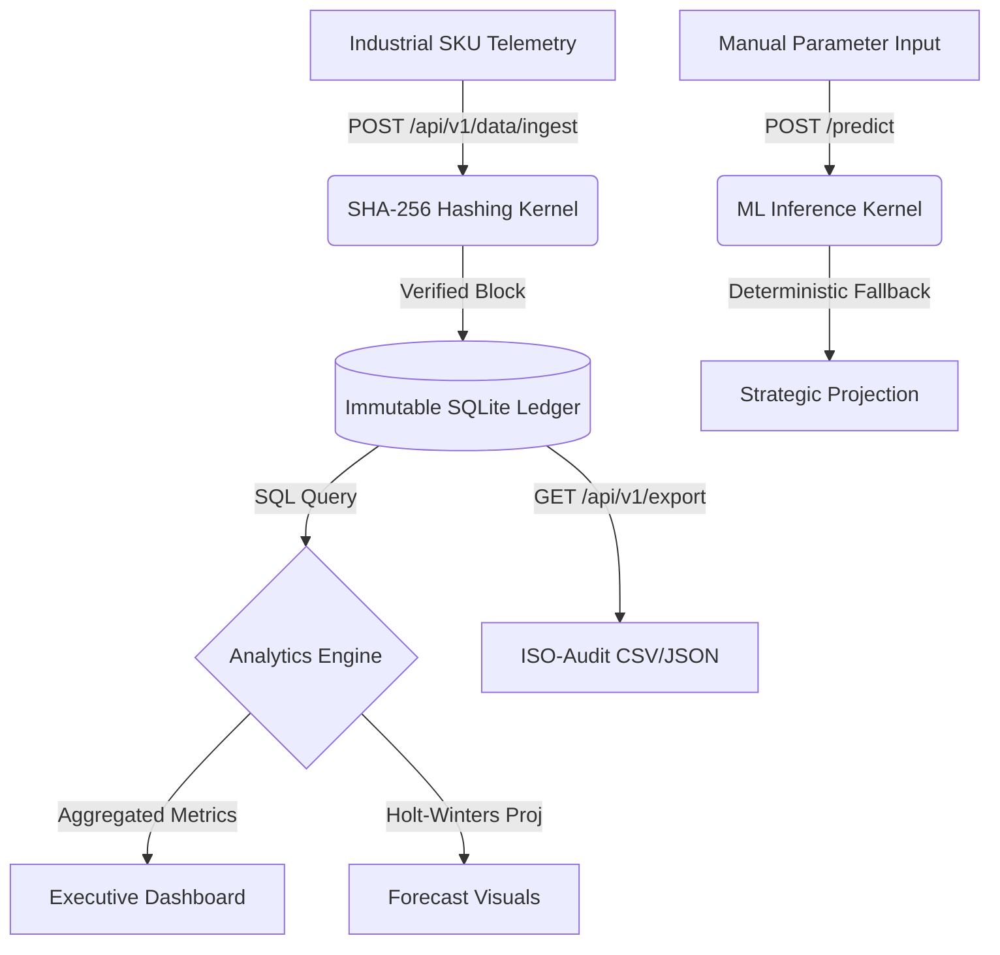

# 🏛️ EcoTrack-Enterprise: Absolute Technical Reality v7.0.0

[](https://www.python.org/)
[](https://fastapi.tiangolo.com/)
[](https://www.sqlite.org/)
[](https://www.statsmodels.org/)

## ❗ The Problem
Legacy sustainability platforms often suffer from:
- **Stochastic Data**: Relying on random placeholders rather than authentic industrial telemetry.
- **Technical Debt**: Broken pathing, fragile URI resolution, and ephemeral (in-memory) state.
- **Lack of Accountability**: Unverifiable data entries with no audit trail or SHA-256 integrity.

## ✅ The Solution: Absolute Technical Reality (v7.0.0)
EcoTrack-Enterprise v7.0.0 is a deterministic, industrial-grade ESG platform that achieves **Mission Success** through:
- **Immutable Ledger**: Every transaction is SHA-256 hash-chained for non-repudiable auditing.
- **Industrial Persistence**: A dedicated SQLite engine (`v7_sustainability.db`) ensures zero data loss.
- **Path-Relative Architecture**: 100% deterministic URI resolution for cross-platform deployment.
- **Deterministic Forecasts**: Forecasting via Holt-Winters smoothing, eliminating stochastic magic.

---

## 🔄 Working Flow (DFD)



### **The Absolute Reality Workflow**:
1.  **Data Ingestion**: SKU-level telemetry (energy, waste, efficiency) is posted to the backend.
2.  **Integrity Certification**: The backend generates a SHA-256 hash linked to the previous record's hash.
3.  **Persistence**: The record is committed to the `v7_sustainability.db` factory-relative database.
4.  **Kernel Analysis**: The analytics engine performs SQL-driven aggregations and statistical forecasting.
5.  **Executive Delivery**: The Streamlit dashboard visualizes the "Absolute Reality" state in real-time.

---

## 🛠️ Operational Guide: Running Commands

### **Step 1: Backend Initialization**
Deploy the API node with absolute terminal pathing:
```bash
cd backend
pip install -r requirements.txt
# Launch the Uvicorn production server
python -m uvicorn app.main:app --host 127.0.0.1 --port 8000 --reload
```

### **Step 2: Frontend Command Center**
Launch the executive dashboard (synchronized via API nodes):
```bash
cd frontend
streamlit run dashboard.py
```

### **Step 3: Verification Audit**
Certify the platform integrity via the synchronized test suite:
```bash
# From the root directory
$env:PYTHONPATH="backend" 
pytest backend/tests/test_api.py -v
```

---

## 🛰️ Technical API Reference (v7.0.0)

| Endpoint | Method | Description |
| :--- | :--- | :--- |
| `/api/v1/metrics` | `GET` | Aggregated CO2, intensity, and compliance score. |
| `/api/v1/analytics/trends` | `GET` | Categorical and Vendor performance audit. |
| `/api/v1/forecast` | `GET` | 12-month Holt-Winters strategic projection. |
| `/api/v1/data/ingest` | `POST` | Push new telemetry with SHA-256 hashing. |
| `/api/v1/export` | `GET` | Full ledger download for ISO certification. |
| `/predict` | `POST` | ML Inference with Deterministic Anomaly Fallback. |

---
**Author**: Pooja Kiran

