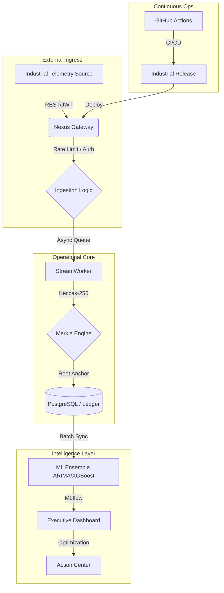

# 🏛️ EcoTrack Industrial Architecture

Detailed system design and component breakdown for the EcoTrack Enterprise Nexus.

## 1. High-Level System Flow (The Nexus Pattern)

## 2. Component Breakdown
- **Gateway**: FastAPI-based high-throughput REST entry point.
- **Merkle Engine**: Hierarchical cryptographic anchoring system.
- **ML Ensemble**: Hybrid time-series and feature-based forecasting engine.
- **Dashboard**: Plotly-powered Streamlit executive interface.
